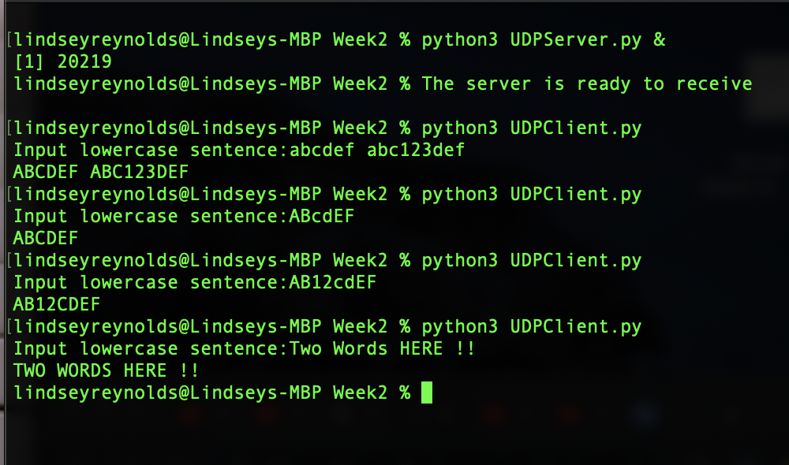
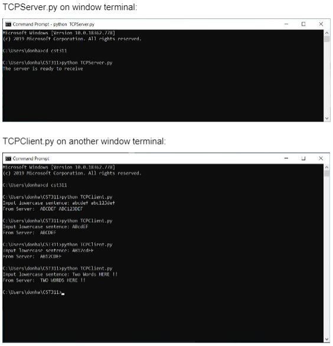
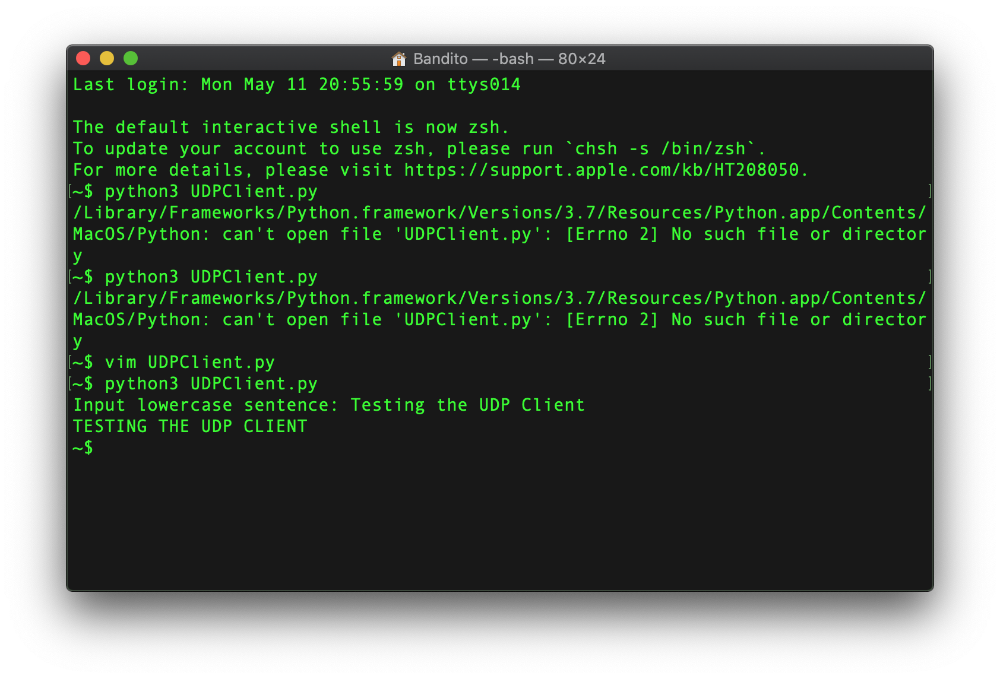
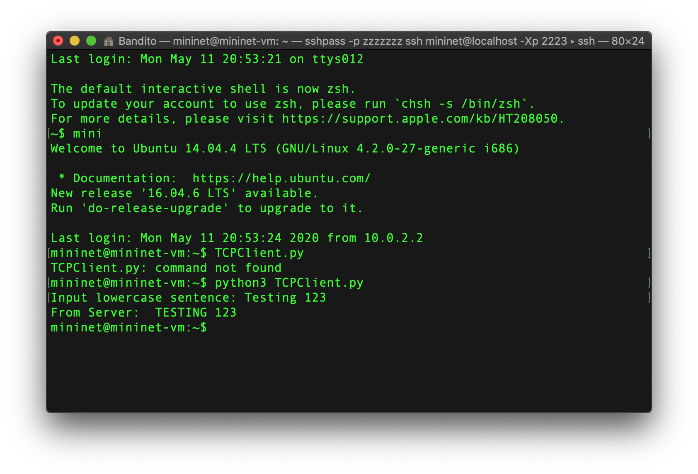

# Programing Assignment 1 Sockets
## Overview
This assignment basically requires you to submit the Python client and server code for the UDP socket programming example in Section 2.7.1 and then also the TCP socket programming example in Section 2.7.2. You should each try to do this on your own first but you will then work with your assigned team for this assignment. Split up your team to have one group do the UDP example together and another group to do the TCP example. The goal of this assignment is a) to learn about how UDP and TCP works and how to program with UDP and TCP and also b) to make sure your computer is set up and working, ready for the next assignment where you will be writing your own code. You are welcome to use whatever IDE the team prefers; for this assignment with about 10 lines of code, you may prefer to simply use an editor but this is up to you. Code it, test it with the following cases:
```
abcdef abc123def
ABcdEF
AB12cdEF
Two Words HERE !!
```
## Objectives
* Create server and client sockets
* Learn to create sockets using TCP
* Learn to create sockets using UDP

## To Run
### Using UDP Protocol
* Open two terminals in the folder containing the files
* Run the Server first on the first terminal using the command:
    * `python UDPServer.py`
* Run the Client on the second terminal using the command: 
    * `python UDPClient.py`
* In the terminal running the client type a sentence in all lower case letters followed by `Enter`
### Using TCP Protocol
* Open two terminals in the folder containing the files
* Run the Server on the first terminal using the command:
    * `python TCPServer.py`
* Run the Client on the second terminal using the command: 
    * `python TCPClient.py`
* In the terminal running the client type a sentence in all lower case letters followed by `Enter`

## Screenshots
### UDP Client and Server Sample Run

### TCP Client and Server Sample Run
# 
### Extra Credit: Ran on Mininet on two seperate hosts
#### UDP

#### TCP


## Lab 1 Extra Credit Participants 
* Barbosa, Ricardo
* Halbert, Max
* Reynolds, Lindsey
* Sedano, Dan