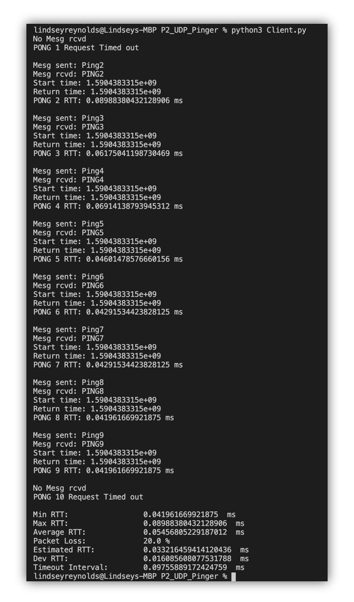
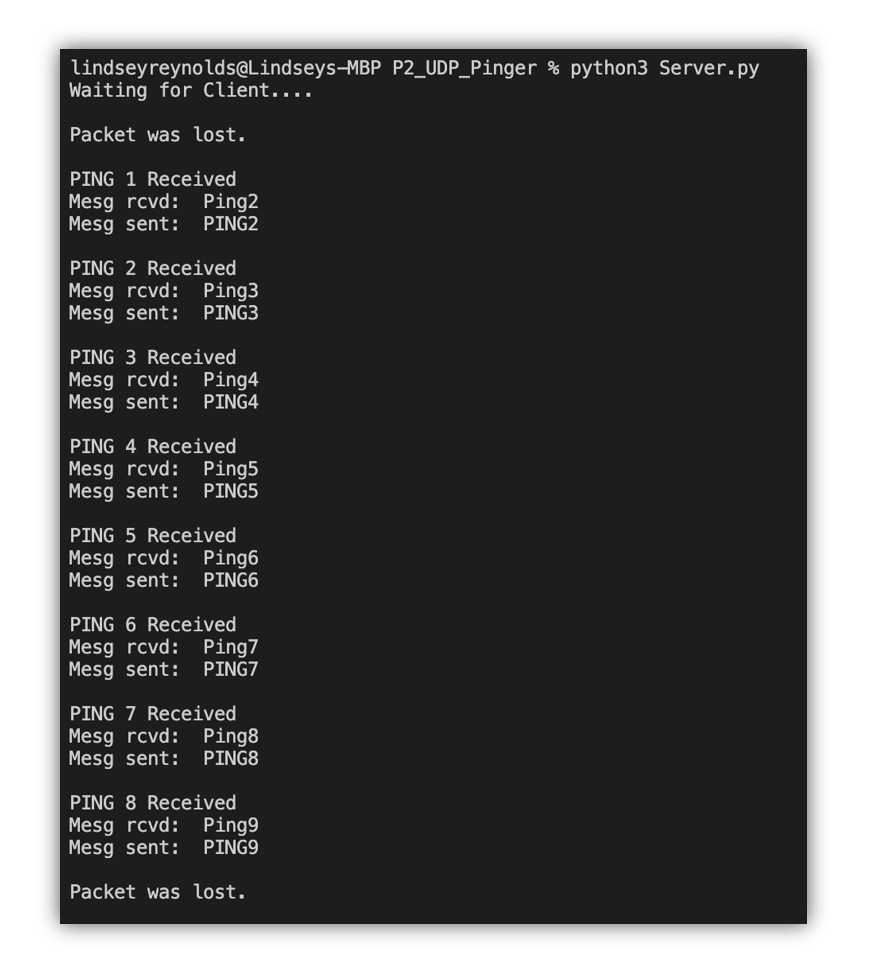

# Programming Assigment 2: UDP Pinger
## Overview
This assignment teaches us the basics of socket programming by learning how to
send packets from a client to a server using UDP (in Python) and setting the 
socket's timeout. 

## Objectives:
* Create server and client sockets using UDP
* Learn to properly set socket timeout
* Send message to server for processing then back to client

## To Run
* Open two terminals in the folder containing the files
* Run the Server on the first terminal using the command:
    * ```python3 Server.py```
* Run the Client on the second terminal using the command: 
    * ```python3 Client.py```
## Screenshots
### Client Output

### Server Output


## Authors and Roles
* Team Lead: Lindsey Reynolds
* Programmer: Ricardo Barbosa
* Programmer: Max Halbert
* Programmer: Dan Sedano