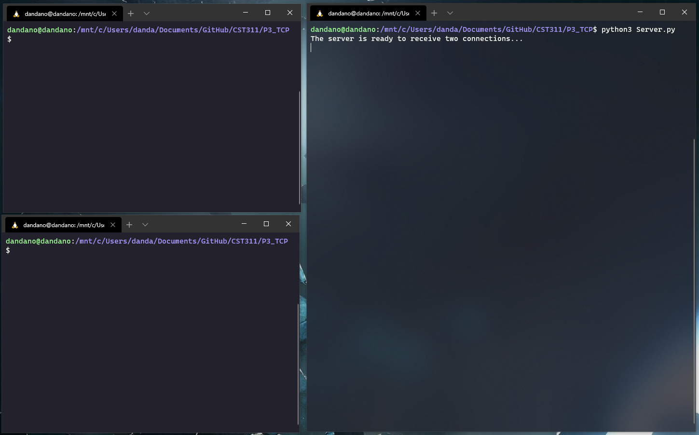
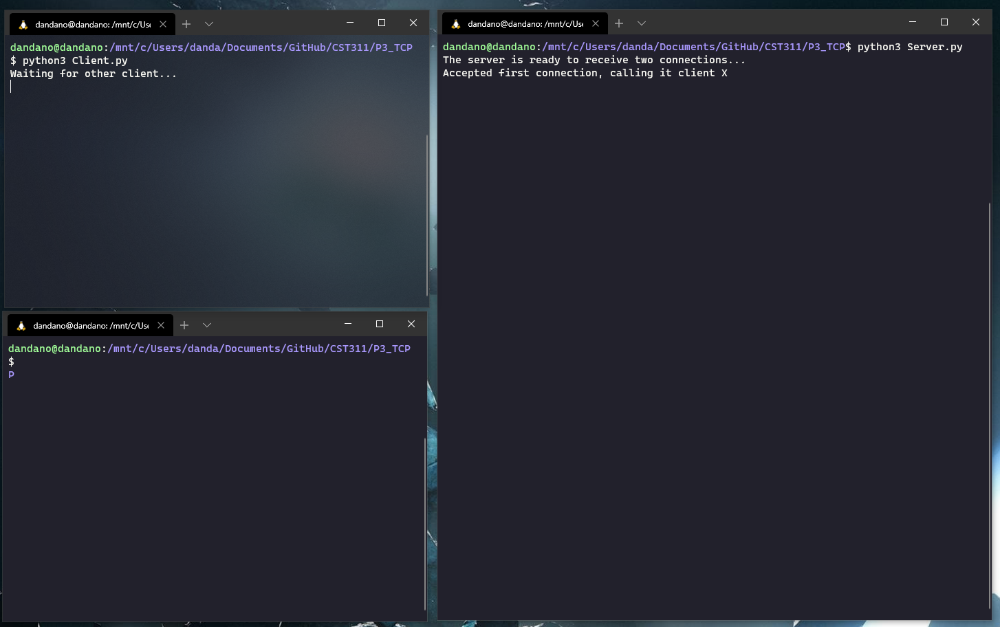
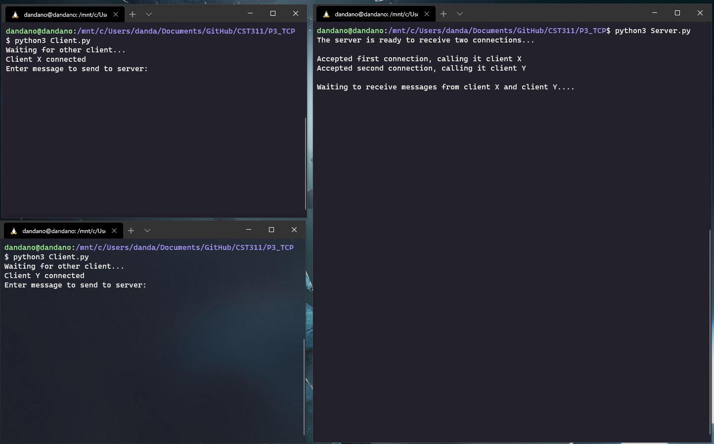
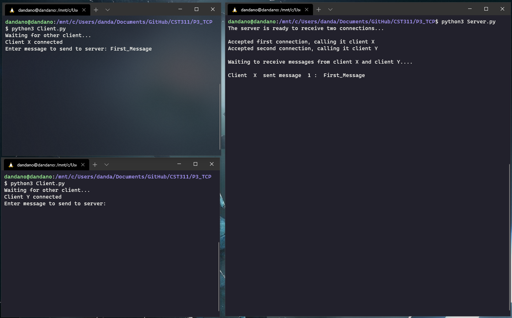
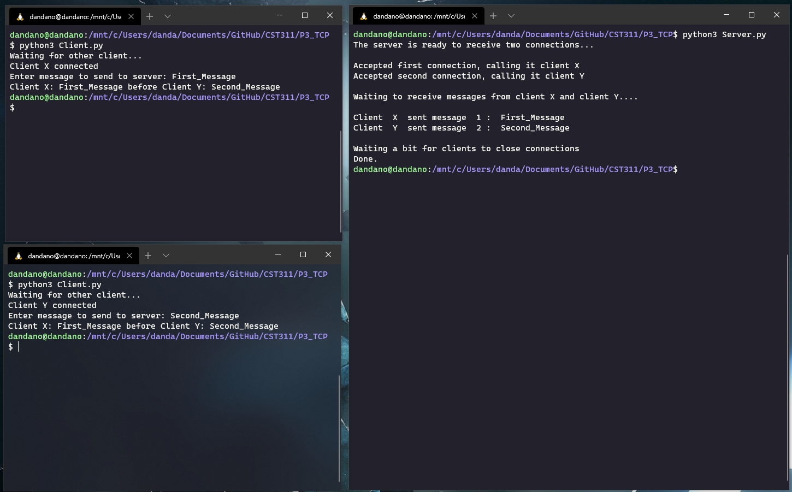
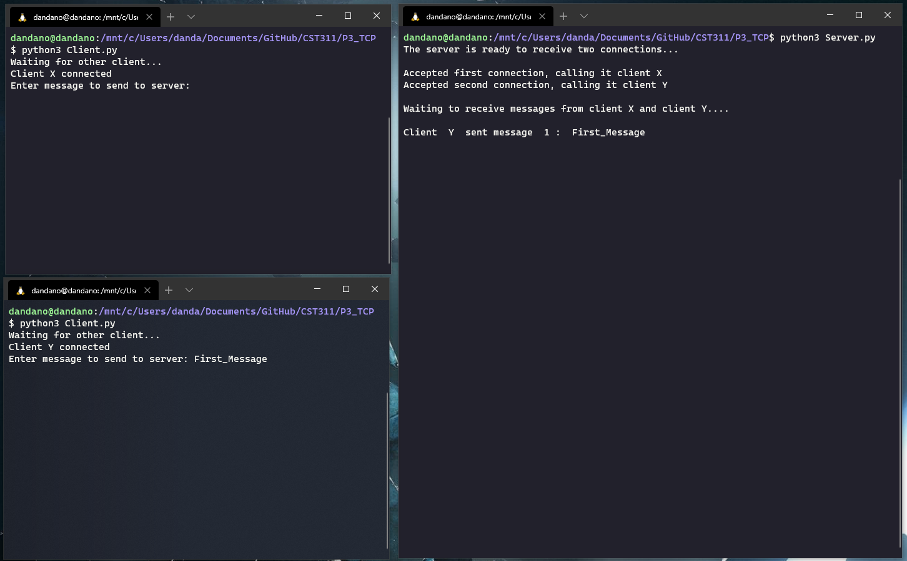
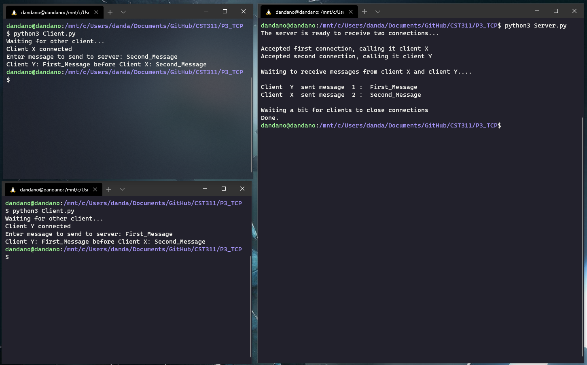

# Programming Assignment 3: TCP With Multiple Clients
## Overview
### Main Assignment:
This project consists of writing a server that will process information for two clients. First two clients must establish a connection with the server before the server will allow the clients to send it messages. The server will then process the messages and broadcast an acknowledgement message to all clients indicating which client sent the first message.
### Extra Credit:
The extra credit assignment is a modified version of the main assignment. Two clients must connect to the server before the clients can send message to the server for processing. Once both connections are established will a message from one client be forwarded to the other client and vice versa.
## Objectives
* Create a TCP Server program with multiple connections
* Use multi-threading to handle multiple connections
## To Run
* Open 3 terminal windows/panes in folder location
* Run server *first* with the command `python3 Server.py`
* Run two clients with the command `python3 Client.py`
## Screenshots
### Case 1: Client X before Client Y

### Case 2: Client Y before Client X

## Authors and Roles
### Team 1 Main Assignment:
  * Dan: Team Lead/Programmer
  * Max: Programmer
### Team 2 Extra Credit:
  * Lindsey: Programmer
  * Ricardo: Programmer
